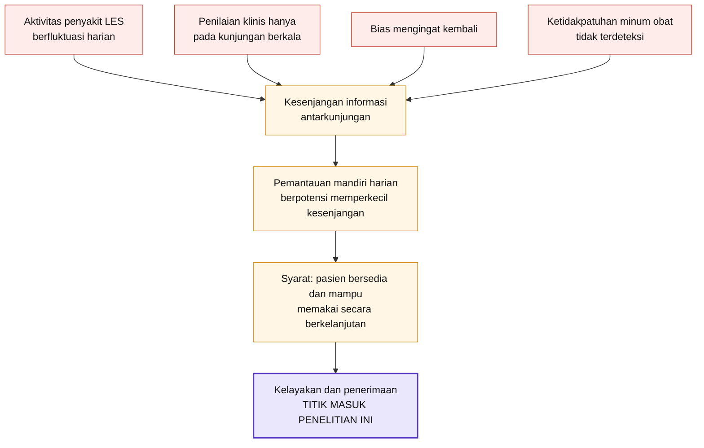
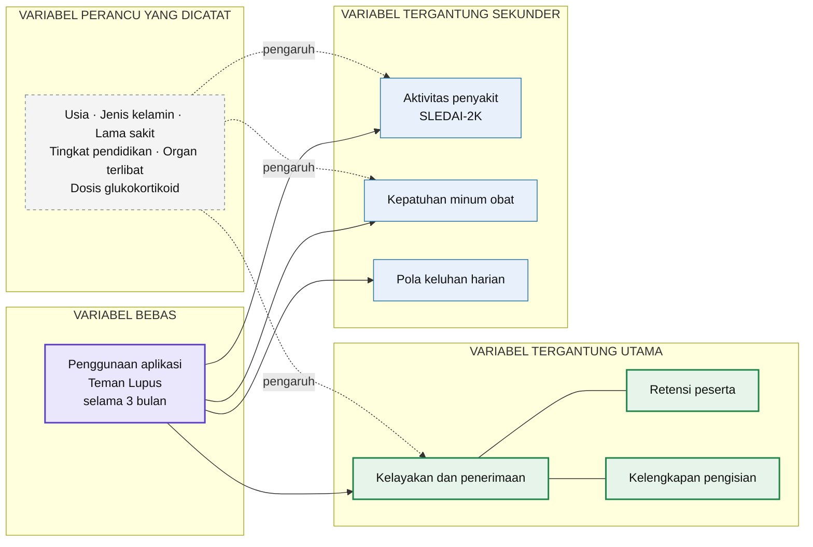
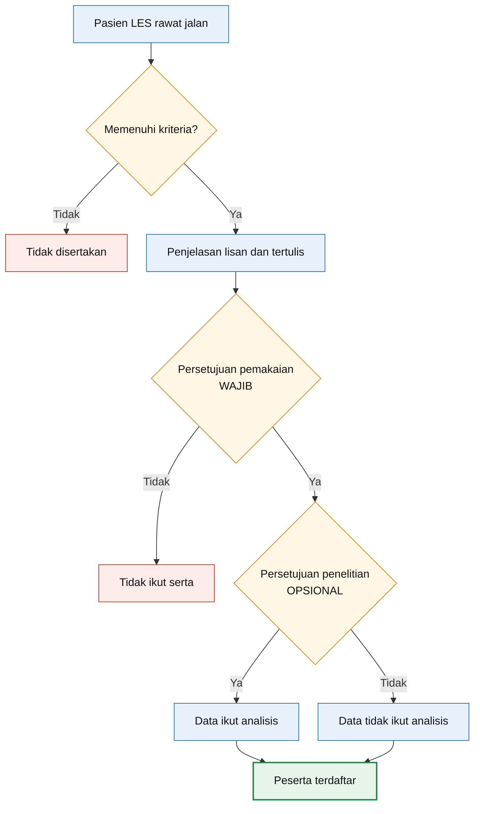
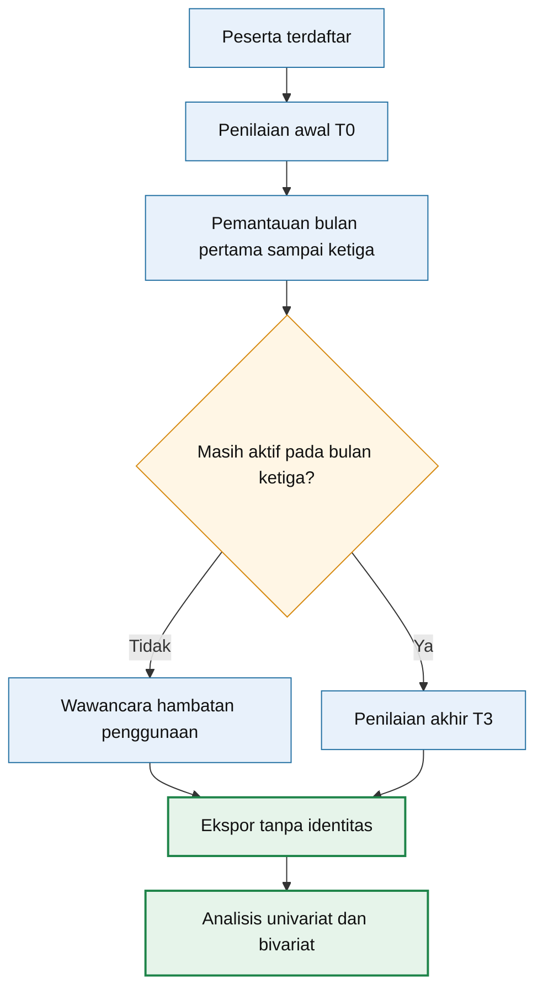

# Gambar untuk proposal — sumber Mermaid

Empat bagan yang diminta *Panduan Penulisan Disertasi* FK USU. Sumbernya
disimpan di sini supaya ikut terlacak bersama proposal; bila isi proposal
berubah, terlihat bahwa bagannya perlu ikut berubah.

## Berkas di folder ini

| Sumber | Hasil | Untuk |
|---|---|---|
| `gambar-2-1.mmd` | `.svg` · `.png` | Kerangka teori |
| `gambar-2-2.mmd` | `.svg` · `.png` | Kerangka konsep |
| `gambar-3-1.mmd` | `.svg` · `.png` | Alur rekrutmen dan persetujuan |
| `gambar-3-2.mmd` | `.svg` · `.png` | Alur pemantauan dan analisis |

Berkas jadi sudah tersedia, jadi tidak perlu dibuat ulang kecuali bagannya
disunting. PNG dibuat pada skala tiga kali dengan latar putih sehingga tetap
tajam saat dicetak.

---

## Cara membuat ulang setelah menyunting

**Tanpa memasang apa pun.** Buka https://mermaid.live, hapus contoh di kotak
kiri, tempel isi berkas `.mmd`, lalu klik **Actions** dan pilih **SVG** atau
**PNG**. Pilih SVG bila akan dicetak, sebab SVG tidak pecah saat diperbesar dan
dapat disisipkan langsung ke Word.

**Di komputer sendiri.**

```bash
cd penelitian/gambar
npx -y @mermaid-js/mermaid-cli@11 -i gambar-3-1.mmd -o gambar-3-1.svg
npx -y @mermaid-js/mermaid-cli@11 -i gambar-3-1.mmd -o gambar-3-1.png -s 3 -b white
```

---

## Ketentuan panduan saat menempel ke Word

1. Judul gambar diletakkan **di bawah** gambar, **tanpa** titik di akhir, huruf
   kapital hanya pada awal kalimat.
2. Nomor gambar mengikuti bab, yaitu Gambar 2.1, Gambar 2.2, Gambar 3.1, dan
   Gambar 3.2.
3. Setiap gambar wajib dirujuk dalam teks.
4. Gambar tidak boleh dipenggal antarhalaman.
5. Judul dan keterangan gambar memakai Times New Roman ukuran 10.

Karena judul harus di bawah gambar, **judul jangan dimasukkan ke dalam bagan**;
ketik sebagai teks biasa di Word tepat di bawah gambarnya.

### Lebar yang disarankan

Lebar bidang ketik A4 dengan margin panduan adalah 14 cm, dan tinggi bidang
ketik 23,7 cm. Angka di bawah sudah menyisakan ruang bagi judul gambar.

| Gambar | Rasio | Lebar disarankan | Tinggi jadinya |
|---|---|---|---|
| 2.1 | 1 : 0,66 | 14 cm | 9,2 cm |
| 2.2 | 1 : 0,68 | 14 cm | 9,5 cm |
| 3.1 | 1 : 1,72 | 12 cm | 20,6 cm |
| 3.2 | 1 : 1,84 | 11 cm | 20,2 cm |

Gambar 3.1 dan 3.2 masing-masing memenuhi hampir satu halaman penuh. Keduanya
sengaja dipisah, sebab digabung menjadi satu bagan menghasilkan tinggi sekitar
28 cm yang pasti terpenggal antarhalaman.

---

## Gambar 2.1 — Kerangka teori

Judul yang diketik di bawah gambar:

> Gambar 2.1 Kerangka teori kesenjangan informasi antarkunjungan pada lupus
> eritematosus sistemik



---

## Gambar 2.2 — Kerangka konsep

Judul yang diketik di bawah gambar:

> Gambar 2.2 Kerangka konsep penelitian



---

## Gambar 3.1 — Alur rekrutmen dan persetujuan

Judul dan keterangan yang diketik di bawah gambar:

> Gambar 3.1 Alur rekrutmen dan persetujuan
>
> Keterangan: peserta yang menolak persetujuan penelitian tetap terdaftar dan
> dapat memakai seluruh fitur aplikasi; hanya datanya yang tidak disertakan
> dalam analisis. Penolakan tidak memengaruhi pelayanan medis yang diterima.



---

## Gambar 3.2 — Alur pemantauan dan analisis

Judul dan keterangan yang diketik di bawah gambar:

> Gambar 3.2 Alur pemantauan dan analisis
>
> Keterangan: penilaian awal T0 meliputi data klinis dasar, SLEDAI-2K, PGA,
> dosis glukokortikoid, dan MARS-5; penilaian akhir T3 mengulang seluruhnya.
> Pemantauan meliputi catatan harian mandiri, penyaringan tanda bahaya bila ada
> keluhan, dan kuesioner yang diulang tiap bulan. Ekspor menghasilkan empat
> belas berkas CSV tanpa identitas dan hanya memuat peserta yang menyetujui
> penelitian.



---

## Catatan isi yang sengaja ditampilkan

**Gambar 3.1 menggambar dua persetujuan sebagai dua percabangan terpisah.**
Percabangan kedua tidak mengeluarkan peserta, melainkan hanya menentukan apakah
datanya ikut analisis; kedua cabangnya sama-sama bermuara pada "Peserta
terdaftar". Inilah gambaran paling ringkas bahwa keikutsertaan penelitian
benar-benar bersifat sukarela, dan hal itulah yang paling ingin dilihat penelaah
etik.

**Peserta yang berhenti tetap masuk alur pada Gambar 3.2.** Anak panah dari
wawancara hambatan menuju ekspor data memperlihatkan bahwa mereka tidak hilang
begitu saja; alasan berhenti justru salah satu tujuan khusus penelitian.

**Variabel perancu pada Gambar 2.2 digambar dengan garis putus-putus** karena
hanya dicatat, bukan dikendalikan. Rancangan ini tidak memiliki kelompok
pembanding.

**Rincian sengaja dipindahkan dari kotak ke keterangan gambar.** Kotak berisi
empat baris teks membuat bagan menjadi terlalu tinggi untuk satu halaman, dan
panduan melarang gambar dipenggal. Panduan membolehkan keterangan ditulis di
bawah gambar secukupnya, sehingga isinya tidak hilang.
